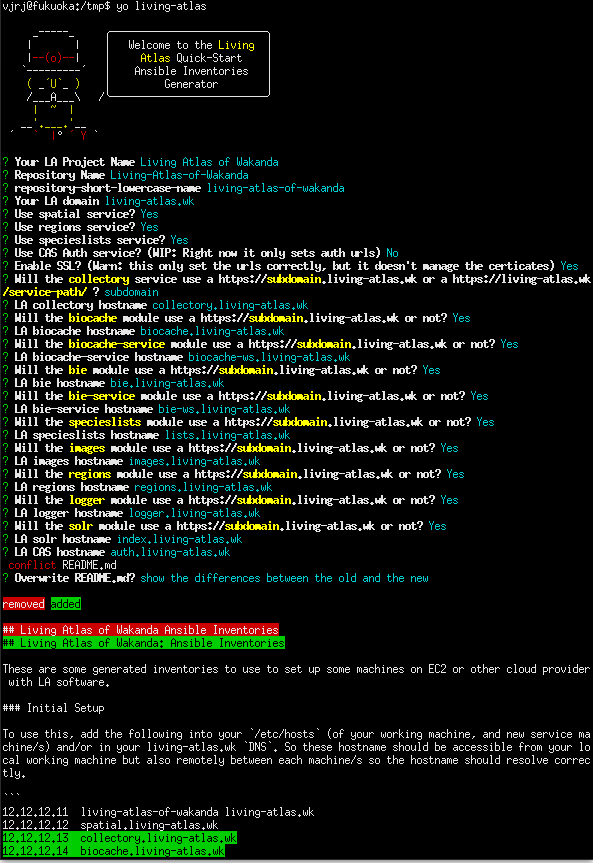

# generator-living-atlas [![NPM version][npm-image]][npm-url] [![Build Status][travis-image]][travis-url] [![Dependency Status][daviddm-image]][daviddm-url]
> An experimal Yeoman Generator for Living Atlas Ansible Inventories

## Intro

This is a simple yeoman generator trying to facilitate a quick start with Living Atlas `ansible` inventories.

So with these generated inventories and [ala-install](https://github.com/AtlasOfLivingAustralia/ala-install/) you should deploy a demo with the main LA sercices quickly.

## Installation

First, install [Yeoman](http://yeoman.io) and generator-living-atlas using [npm](https://www.npmjs.com/) (we assume you have pre-installed [node.js](https://nodejs.org/)).

```bash
npm install -g yo
```

This generator is experimental and it's not published in npm. So if you want to test it, you can clone this repo and:

```bash
npm link
cd /tmp # or other directory
yo living-atlas
```

If we publish this generator in some the future:

```bash
npm install -g yo
npm install -g generator-living-atlas
```

Then generate your new project:

```bash
yo living-atlas
```
## Screenshot



## Getting To Know Yeoman

 * Yeoman has a heart of gold.
 * Yeoman is a person with feelings and opinions, but is very easy to work with.
 * Yeoman can be too opinionated at times but is easily convinced not to be.
 * Feel free to [learn more about Yeoman](http://yeoman.io/).

## License

Apache-2.0 © [Living Atlases](https://living-atlases.gbif.org)


[npm-image]: https://badge.fury.io/js/generator-living-atlas.svg
[npm-url]: https://npmjs.org/package/generator-living-atlas
[travis-image]: https://travis-ci.org/vjrj/generator-living-atlas.svg?branch=master
[travis-url]: https://travis-ci.org/vjrj/generator-living-atlas
[daviddm-image]: https://david-dm.org/vjrj/generator-living-atlas.svg?theme=shields.io
[daviddm-url]: https://david-dm.org/vjrj/generator-living-atlas
