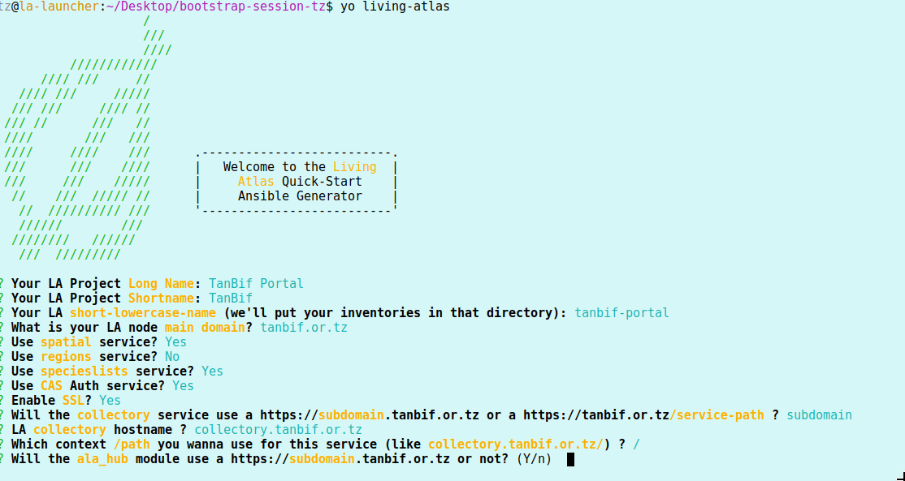

# generator-living-atlas [![NPM version][npm-image]][npm-url] [![Dependency Status][daviddm-image]][daviddm-url]

> A Yeoman Generator for Living Atlas Ansible Inventories


* [Intro](#intro)
* [Installation](#installation)
* [Options](#options)
* [Screens](#screens)
* [Rerunning the generator](#rerunning-the-generator)
* [Ansible Wrapper](#ansible-wrapper)
* [TODO](#todo)
* [Caveats](#caveats)
* [Any problem with this generator?](#any-problem-with-this-generator)
* [But why this?](#but-why-this)
* [Can these quick-start inventories solve all this?](#can-these-quick-start-inventories-solve-all-this)
* [About Yeoman](#about-yeoman)
* [License](#license)

## Intro

This is a simple [yeoman](http://yeoman.io/) generator, so, just by asking some simple questions about your [Living Atlases](https://living-atlases.gbif.org/) Node, you will get a functional configuration for the setup of your Virtual Machines (VMs) using `ansible`.

The main goal of this utility is to allow you to configure, install & maintain a [Living Atlas](https://living-atlases.gbif.org/) infrastructure in a fast & smooth way.

In others words, with the `ansible` inventories produced by this `yeoman` generator and the [ala-install](https://github.com/AtlasOfLivingAustralia/ala-install/) `ansible` playbooks you should deploy the main LA services quickly and without too much pain.

Also, thanks to `yeoman`, you can rerun this generator, for instance, to enable new modules in the future, or to enable eg. SSL, etc. and reuse your previous settings and compare the differences (see the [screenshots](#screens)).

## Installation

First, install [Yeoman](http://yeoman.io) and `generator-living-atlas` using [npm](https://www.npmjs.com/) (we assume you have pre-installed [node.js](https://nodejs.org/)).

```bash
npm install -g yo
```
As this is a `yeoman` development environment you can get some `EPERM` or `EACCESS` errors, so check the [yeoman setup guide](https://yeoman.io/codelab/setup.html) for proper configuration.

Later, install the generator itself:

```bash
npm install -g generator-living-atlas
```

Then generate your new project:

```bash
yo living-atlas
```

## Options

- Use `yo living-atlas --replay` to reuse all the previous responses and regenerate the inventories with some new modifications (or improvements if you update this repo). More info below.
- Use `yo living-atlas --replay-dont-ask` if you only want to repeat the inventories generation (for instance, with a new version of this generator to get some update, or when you edit carefully the `../.yo-rc.json` answers file to, for instance, enable ssl or some service, and only want to regenerate the inventories with the changes).
- Also, you can use `--debug` to see some verbose debug info.

## Screens

A screen recording re-running the generator but using another solr hostname and switching to use SSL (see the differences in the generated inventories):


After running the inventories following the instructions from the generated README over two VMs (like in the Paris 2019 Workshop):


Using it for Tanzania demo session:



Differences beween two runs:


## Rerunning the generator

You can rerun the generator with the option `yo living-atlas --replay` to reuse all the previous responses and regenerate the inventories with some modifications (if for instance you want to add a new service, or use a new version of this generator with improvements).

With `--replay-dont-ask` you can regenerate the playbooks with previous answers without being asked again. This is useful for new versions of this generator, or if you manually edit `.yo-rc.json` where your answers are stored, or for automated processes (like ci integrations).

We recommend to override and set variables adding then to `quick-start-local-extras.yml` and `quick-start-spatial-local-extras.yml` without modification of the generated `quick-start-inventory.yml` and `quick-start-spatial-inventory.yml`, so you can rerun the generator in the future without losing local changes.  The `*-local-extras.sample` files will be updated with future versions of this generator, so you can compare from time to time these samples with your `*-local-extras.yml` files to add new vars, etc.

## Ansible wrapper

Furthermore the utility `ansiblew` is generated. `ansiblew` is an `ansible-playbook` wrapper that can help you to use the inventories and can be easily modified by you to suit your needs. It depends on `python-docopt` package (`sudo apt install python-docopt` in debian and derivatives).

Help output:

```
$ ./ansiblew --help

This is an ansible wrapper to help you to exec the different playbooks with your
inventories.

By default don't exec anything only show the commands. With --nodryrun you can exec
the real commands.

With 'main' only operates over your main host.

Usage:
   ansiblew --alainstall=<dir_of_ala_install_repo> [options] [ main | collectory | ala_hub | biocache_service | ala_bie | bie_index | images | lists | regions | logger | solr | cas | biocache_backend | biocache_cli | spatial |  all ]
   ansiblew -h | --help
   ansiblew -v | --version

Options:
  --nodryrun             Exec the ansible-playbook commands
  -p --properties        Only update properties
  -l --limit=<hosts>     Limit to some inventories hosts
  -s --skip=<tags>       Skip tags
  -h --help              Show help options.
  -d --debug             Show debug info.
  -v --version           Show ansiblew version.
----
ansiblew 0.1.0
Copyright (C) 2019 living-atlases.gbif.org
Apache 2.0 License
```

So you can install the CAS service or the spatial service with simple commands like:

```bash
./ansiblew --alainstall=../ala-install cas --nodryrun
```

and

```bash
./ansiblew --alainstall=../ala-install spatial --nodryrun
```

or all the services with something like:

```bash
./ansiblew --alainstall=../ala-install all --nodryrun
```

Without `--nodryrun` you will get only the full `ansible-playbook` command to use these inventories .

## Sample `~/.ssh/config`

A sample `dot-ssh-config.sample` is generated that you can edit and move to `~/.ssh/config` in orther to access to you VMs easily.

## Maintain your inventories over time

As we mentioned previously you can rerun the generator with the option `yo living-atlas --replay` to reuse all the previous responses and regenerate the inventories with some modifications (if for instance you want to add a new service, or use a new version of this generator with improvements).

## Caveats

- Currently running several services in the same machine and the same domain doesn't configure correctly `nginx` `vhosts`. See [this enhancement issue](https://github.com/AtlasOfLivingAustralia/ala-install/issues/256) in `ala-install`. **Workaround**: Use different hostnames per each service in the same machine. So, if for instance, `bie` and `bie-ws` are in the same machine, this machine receives multiple names (like `bie.example.org` and `bie-ws.example.org`) and `nginx` doesn't overwrite each service vhost configuration. See the [LA FAQ](https://github.com/AtlasOfLivingAustralia/documentation/wiki/FAQ) for more details.

## Any problem with this generator?

Please [add an issue](https://github.com/vjrj/generator-living-atlas/issues/new) give us details of your problem and we'll try to help you and to improve the generator. Thanks!

## About Yeoman

 * [Learn more about Yeoman](http://yeoman.io/).

## License

Apache-2.0 © [Living Atlases](https://living-atlases.gbif.org)

[npm-image]: https://badge.fury.io/js/generator-living-atlas.svg
[npm-url]: https://npmjs.org/package/generator-living-atlas
[travis-image]: https://travis-ci.org/vjrj/generator-living-atlas.svg?branch=master
[travis-url]: https://travis-ci.org/vjrj/generator-living-atlas
[daviddm-image]: https://david-dm.org/vjrj/generator-living-atlas.svg?theme=shields.io
[daviddm-url]: https://david-dm.org/vjrj/generator-living-atlas
