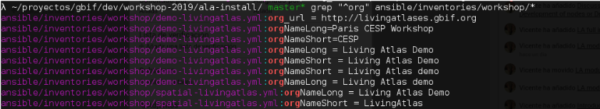
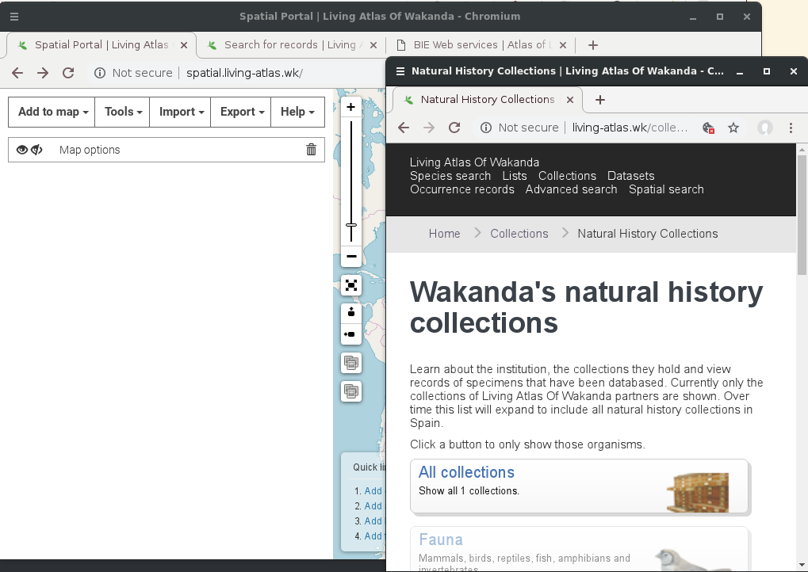
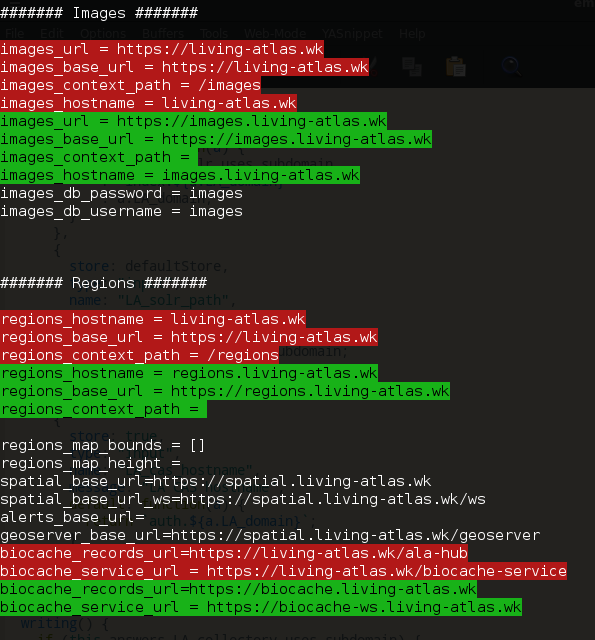
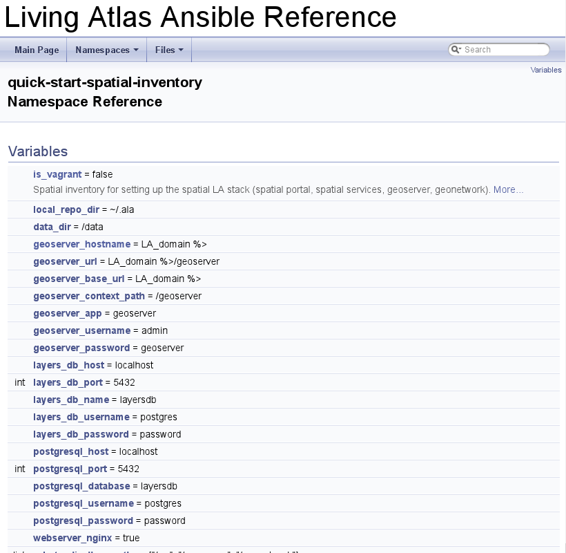

# generator-living-atlas [![NPM version][npm-image]][npm-url] [![Build Status][travis-image]][travis-url] [![Dependency Status][daviddm-image]][daviddm-url]
> An experimental Yeoman Generator for Living Atlas Ansible Inventories

## Intro

This is a super simple `yeoman` generator, a proof of concept trying to facilitate a quick start with Living Atlas `ansible` inventories.

So with the inventories produced by this `yeoman` generator and the [ala-install](https://github.com/AtlasOfLivingAustralia/ala-install/) `ansible` playbooks you should deploy a demo with the main LA services quickly and without too much pain.

Also, thanks to `yeoman`, you can rerun the assistant enabling, for instance, some new module reusing your previous settings and comparing the differences (see the screenshots).

## But why this?

Ansible is a fantastic tool for manage LA node infrastructures. But nowadays we have some problems with our current `ala-install` inventories/roles & documentation that make their use difficult by newcomers nodes, but also for other non-Australian nodes maintenance:
- There are many config properties that are not documented and this makes quite difficult to tune a LA node
- Sometimes the `/data/*/config/*properties` are well commented but not their source inventories
- From time to time new properties appears but others not ALA nodes don’t notice
- We end using several self-made inventories, duplicate properties (like orgName, urls, etc), and many times this is a source of problems (like [code duplication](https://en.wikipedia.org/wiki/Duplicate_code)). Some minor sample:

- There is a lack of more real production-ready inventories (you have to ask for then).
- `ala-install` has a structure that sometimes is difficult to find some samples or how to start to deploy some service (think in CAS)
- Many times you have to check the `ansible` generated `config/*properties` for non configured or default properties, search the `ansible` role code for know how to configure these variables, re-run `ansible` with these new variables and re-check the `ansible` `/data/*/config/*properties`.
- The demo inventory (or the last Paris workshop inventories) are a good sample but not enough for a new production LA node (lack of inventory variables documentation, missing of important services like regions or CAS)
- We have a lack of info about services versions compatibility
- Sometimes default module versions in inventories or `LATEST` nexus packages are not the correct/latest ones.
- It would be nice to choose strategies that was usable by ALA too (not only LA nodes) - that might help maintenance.

## Can these quick-start inventories solve all this?

No. This is only a *Proof of Concept* that tries to mitigate some of the previous problems.

If we think that some tool like this can be useful, we can add more functionality like:

- Better comments of properties in generated inventories for easy operation & tuning
- CAS deployment
- Allow deployment in multiple machines (right now this is only tested using two VMs)
- Focus in have well maintained these generator and their inventories
- Autogenerate documentation from the inventories comments with tools like `doxygen`
- etc

or maybe this experiment suggests us other path to follow.

## Installation

First, install [Yeoman](http://yeoman.io) and generator-living-atlas using [npm](https://www.npmjs.com/) (we assume you have pre-installed [node.js](https://nodejs.org/)).

```bash
npm install -g yo
```

Wait!, this generator is experimental and it's not published in npm. So if you want to test it, you can clone this repo and:

```bash
npm link
cd /tmp # or other directory
yo living-atlas
```

If we decide to publish this generator in the future, the normal use is like:

```bash
npm install -g yo
npm install -g generator-living-atlas
```

Then generate your new project:

```bash
yo living-atlas
```
### Options

- You can use `--debug` to see some debug info.
- And `--replay` to use all the previous responses and regenerate the inventories with some modification.

## Screens

A screen recording re-running the generator but using another solr hostname and switching to use SSL (see the differences in the generated inventories):


After running the inventories following the instructions from the generated README over two VMs (like in the Paris 2019 Workshop):



Differences beween two runs:



We can use these inventories as a base for extracting documentation via `doxygen` (or similar):



### TODO

- [x] Add basic services (`collectory`, `ala-hub`, etc).
- [x] Add domain/context and service subdomains support
- [x] Add `http`/`https` urls support (this does **not** include `ssl` certificates management)
- [X] Add `regions` service
- [X] Add `species-list` service
- [X] Add `spatial` service
- [x] Disable caches when using the same host for collectory & biocache
- [x] use `--limit` with hostnames
- [x] Improve README hosts
- [x] Improve README playbook commands
- [ ] Add ansible wrapper with/wo
docopt?
- [ ] document `--skip`
- [ ] Add `CAS` 5 service
- [ ] Better testing
- [ ] Use git to track your inventories changes (recommended) ?


## Getting To Know Yeoman

 * Yeoman has a heart of gold.
 * Yeoman is a person with feelings and opinions, but is very easy to work with.
 * Yeoman can be too opinionated at times but is easily convinced not to be.
 * Feel free to [learn more about Yeoman](http://yeoman.io/).

## License

Apache-2.0 © [Living Atlases](https://living-atlases.gbif.org)


[npm-image]: https://badge.fury.io/js/generator-living-atlas.svg
[npm-url]: https://npmjs.org/package/generator-living-atlas
[travis-image]: https://travis-ci.org/vjrj/generator-living-atlas.svg?branch=master
[travis-url]: https://travis-ci.org/vjrj/generator-living-atlas
[daviddm-image]: https://david-dm.org/vjrj/generator-living-atlas.svg?theme=shields.io
[daviddm-url]: https://david-dm.org/vjrj/generator-living-atlas
